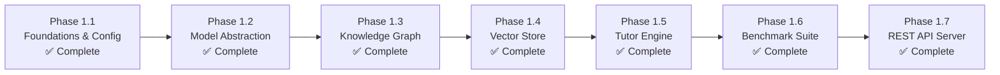

# Member 5 (AI & Knowledge Layer) — Implementation Phases & Roadmap

> **Owner**: Member 5  
> **Status**: Phase 1 Fully Complete (All Tier Models Installed & Verified)  

---

## Overview

Member 5 development is structured into 7 sequential execution phases. All source architecture, knowledge graph algorithms, vector store integrations, tutor services, benchmark suites, REST API routes, and local model installations (including Gemma 4 E2B, SmolLM2 1.7B, and All-MiniLM) have been completed and verified with 100% test pass rate.

---

## Phase Breakdown

### Phase 1.1: Foundations, Dependencies & Configuration
- [x] Environment audit (detected existing Python 3.13 packages, avoided redundant installs).
- [x] Install missing packages (`networkx`, `sqlite-vec`, `aiohttp`, `pytest`, `pytest-asyncio`).
- [x] Establish `src/config.py` using Pydantic Settings loading from `.env`.
- [x] Verify local Ollama server connectivity at `http://localhost:11434`.
- [x] Update Ollama to `v0.33.2` for 2026 MoE architecture support.
- [x] Pull local models:
  - [x] `all-minilm:l6-v2` (Embeddings)
  - [x] `smollm2:1.7b` (Tier 1 Classifier & Fast Reasoning)
  - [x] `gemma4:e2b` (Tier 2/3 On-Device Reasoning & Multimodal VLM)
  - [x] `gemma2:2b` (Backup SLM)

### Phase 1.2: Model Abstraction Layer (MAL)
- [x] Define `ModelProvider` protocol and unified data contracts in `src/models/base.py`.
- [x] Implement `OllamaProvider` connecting to local Ollama daemon for text, chat, and embeddings.
- [x] Implement `MockModelProvider` for high-speed offline unit testing.
- [x] Implement `CloudModelProvider` supporting Google Gemini with automated PII redaction.
- [x] Implement `ModelRegistry` with task routing (`classify`, `reason`, `vision`, `embed`) and graceful fallback.

### Phase 1.3: Personal Knowledge Graph (PKG) & Epistemic Engine
- [x] Implement `SkillNode`, `EvidenceRecord`, and `PrerequisiteRelation` schemas in `src/knowledge/models.py`.
- [x] Implement SQLite schema and persistence adapter in `src/knowledge/store.py`.
- [x] Implement in-memory NetworkX directed graph logic in `src/knowledge/graph.py` (topological sort, prerequisite tree search, cycle detection).
- [x] Implement multi-signal confidence scoring and decay algorithms in `src/knowledge/scoring.py`.
- [x] Seed default C programming and Python skill taxonomies.

### Phase 1.4: Vector Store & Semantic Embeddings
- [x] Implement `VectorStore` using `sqlite-vec` in `src/embeddings/vector_store.py`.
- [x] Implement `Embedder` interfacing with Ollama `/api/embed` (`all-minilm:l6-v2`) in `src/embeddings/embedder.py`.
- [x] Implement KNN semantic retrieval with cosine similarity scoring and top-k filtering.

### Phase 1.5: Progressive Tutor & Pedagogical Engine
- [x] Implement 5-tier progressive assistance generator in `src/tutor/hints.py`:
  - L1: Non-spoiling diagnostic hint
  - L2: First-principles concept explanation
  - L3: Detailed breakdown with analogies
  - L4: Targeted practice question
  - L5: Complete guided solution
- [x] Implement concept explanations integrating user's mastered concepts as analogies in `src/tutor/explanations.py`.
- [x] Implement adaptive learning roadmap builder in `src/tutor/roadmaps.py` with pacing controls (30m, 1h, 2h/day).

### Phase 1.6: Model Benchmarking Suite
- [x] Implement standardized benchmark harness in `src/benchmark/suite.py`.
- [x] Implement 10 canonical Tesseract evaluation tasks in `src/benchmark/tasks.py`.
- [x] Implement metrics logger (accuracy %, average latency ms, output preview).

### Phase 1.7: Async REST API Server & Testing
- [x] Implement `aiohttp` application in `src/api/app.py` listening on port `9701`.
- [x] Implement bearer token authentication middleware in `src/api/middleware.py`.
- [x] Wire `/api/v1/inference/*`, `/api/v1/knowledge/*`, `/api/v1/tutor/*`, and `/api/v1/models/*` routes.
- [x] 100% test pass rate across 20 automated tests in `tests/`.
